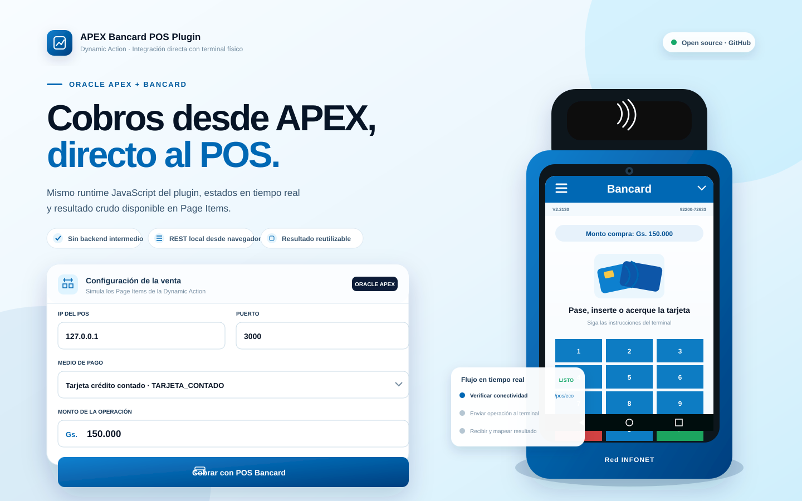
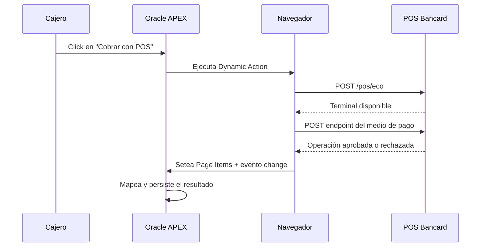
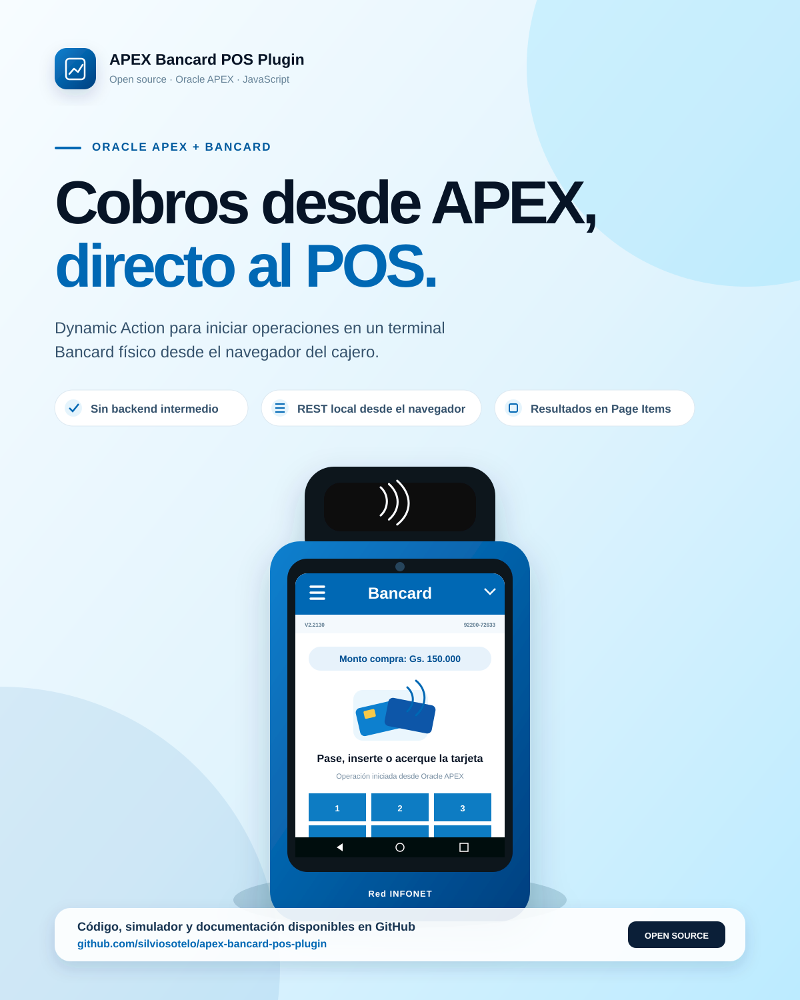

<div align="center">

# Oracle APEX · Bancard POS Plugin

**Dynamic Action para iniciar cobros en un terminal físico Bancard directamente desde el navegador del cajero.**

[](https://apex.oracle.com/)
[](js/pos_bancard_cliente.js)
[](LICENSE)
[](#)

</div>

<p align="center">
  
</p>

> [!IMPORTANT]
> Proyecto independiente y no oficial. **Bancard**, **Red INFONET**, **Oracle** y **Oracle APEX** son marcas de sus respectivos titulares. Este repositorio no implica afiliación, certificación ni soporte oficial de esas empresas.

---

## Qué resuelve

En muchas implementaciones APEX, el servidor de aplicaciones está en la nube o en una red distinta a la caja. Por ese motivo, un proceso PL/SQL o un servicio backend no siempre puede alcanzar la IP privada del terminal POS.

Este plugin usa un enfoque diferente:

- el navegador del cajero se encuentra en la misma LAN que el terminal;
- la Dynamic Action ejecuta JavaScript en el cliente;
- el JavaScript llama por REST a la IP y puerto local del POS;
- el resultado se escribe en Page Items configurables de Oracle APEX;
- la aplicación conserva el control del guardado, mapeo y lógica de negocio.

No existe un round-trip obligatorio hacia un servidor intermedio durante el cobro.

## Arquitectura



## Características

- Dynamic Action reutilizable para Oracle APEX.
- Comunicación navegador → POS por REST local.
- Verificación previa de disponibilidad mediante `POST /pos/eco`.
- Timeout corto para conectividad y timeout extendido para la interacción del cliente.
- Soporte para tarjetas, QR, PIX, canje y billeteras.
- Resultado crudo disponible para que cada aplicación haga su propio mapeo.
- Eventos `change` en los items destino.
- SweetAlert2 empaquetado localmente, sin CDN obligatorio.
- Simulador POS en Python sin dependencias externas.
- Demo standalone con representación visual de un Bancard SmartPOS.
- Exports reales y separados para APEX 20.2 y APEX 24.2.

## Estructura del repositorio

```text
apex-bancard-pos-plugin/
├── install/
│   ├── install_plugin_apex20.sql
│   ├── install_plugin_apex24.sql
│   └── manual_ui_install.md
├── js/
│   ├── demo.html
│   ├── pos_bancard_cliente.js
│   └── vendor/
│       └── sweetalert2.min.js
├── simulator/
│   ├── pos_simulator.py
│   └── README.md
├── docs/
│   ├── assets/
│   │   ├── demo-preview.svg
│   │   └── linkedin-cover.svg
│   └── linkedin-post.md
├── LICENSE
└── README.md
```

## Instalación

### Opción recomendada: importar el export del plugin

Seleccioná el archivo correspondiente a tu versión:

| Versión APEX | Archivo |
|---|---|
| APEX 20.2 | [`install/install_plugin_apex20.sql`](install/install_plugin_apex20.sql) |
| APEX 24.2 | [`install/install_plugin_apex24.sql`](install/install_plugin_apex24.sql) |

Antes de ejecutar el script, reemplazá los valores indicados al comienzo:

```plsql
p_default_workspace_id
p_default_application_id
p_default_owner
```

Ejecutalo desde:

```text
SQL Workshop → SQL Scripts
```

No se recomienda ejecutarlo desde **SQL Commands**, porque el archivo puede superar el límite admitido por esa pantalla.

### Opción manual

La creación paso a paso desde la interfaz de APEX está documentada en:

[`install/manual_ui_install.md`](install/manual_ui_install.md)

## Configuración de la Dynamic Action

La integración habitual tiene tres pasos.

### 1. Resolver la configuración del terminal

Usá una acción nativa **Execute Server-side Code** antes de ejecutar el plugin:

```plsql
declare
  l_ip_pos      mi_tabla_terminales.ip_pos%type;
  l_puerto_pos  mi_tabla_terminales.puerto_pos%type;
begin
  select t.ip_pos, t.puerto_pos
    into l_ip_pos, l_puerto_pos
    from mi_tabla_terminales t
   where t.id_sucursal = :P_ID_SUCURSAL
     and t.puesto      = :P_PUESTO
     and t.activo      = 'S';

  :P_POS_IP := l_ip_pos;
  :P_POS_PUERTO := to_char(l_puerto_pos);
  :P_POS_MEDIO_PAGO :=
    case :P_TIPO_TARJETA
      when 4 then 'TARJETA_DEBITO'
      else 'TARJETA_CONTADO'
    end;

  :P_POS_MONTO_PLANO := trim(replace(:P_MONTO, '.', ''));
exception
  when no_data_found then
    raise_application_error(
      -20001,
      'No hay un POS Bancard configurado para este puesto de cobro.'
    );
end;
```

Configurá correctamente **Items to Submit** e **Items to Return**. No mezcles este patrón con `apex_application.g_x01` y `sys.htp.p`, que corresponden a un Ajax Callback invocado manualmente.

### 2. Ejecutar el plugin

Agregá la acción:

```text
POS Bancard - Cobro directo (cliente)
```

El plugin expone 11 atributos:

| # | Atributo | Valor esperado |
|---:|---|---|
| 1 | Item: IP del POS | IP privada o hostname local |
| 2 | Item: Puerto del POS | Puerto HTTP del terminal |
| 3 | Item: Medio de Pago | Código de operación |
| 4 | Item: Monto | Número plano, sin separadores |
| 5 | Item: Datos Adicionales | JSON opcional |
| 6 | Destino: Nro. Boleta / Autorización | Respuesta cruda |
| 7 | Destino: Issuer ID | Código crudo del emisor |
| 8 | Destino: Monto Cobrado | Número plano |
| 9 | Destino: Fecha/Hora | ISO 8601 |
| 10 | Destino: Nro. Referencia | Referencia generada |
| 11 | Destino: Resultado Completo | JSON crudo opcional |

### 3. Mapear el resultado

La ejecución del POS es asíncrona. El mapeo debe realizarse en una Dynamic Action separada, disparada por el evento **Change** de uno de los items destino.

```javascript
function formatMiles(value) {
  var number = Math.round(Number(value) || 0);
  return number.toString().replace(/\B(?=(\d{3})+(?!\d))/g, ".");
}

apex.item("P_MONTO_FORMATEADO").setValue(
  formatMiles(apex.item("P_POS_MONTO_COBRADO").getValue())
);

var issuerId = apex.item("P_POS_ISSUER_ID").getValue();
var marcaInterna = MI_CATALOGO_MARCAS[issuerId] || 99;

apex.item("P_MARCA_TARJETA").setValue(marcaInterna);
```

El plugin no acopla `issuerId`, fechas o montos a un modelo de datos empresarial específico. Esa decisión permite instalarlo en aplicaciones distintas sin modificar el runtime.

## Medios de pago soportados

| Código | Endpoint principal | Datos adicionales |
|---|---|---|
| `TARJETA_CONTADO` | `venta-ux` → `descuento` | — |
| `TARJETA_CUOTAS` | `venta-ux` → `descuento` | `{"cuotas":3,"plan":1}` |
| `TARJETA_DEBITO` | `venta/debito` → `descuento` | — |
| `TARJETA_CREDITO` | `venta/credito` → `descuento` | `{"cuotas":3,"plan":1}` |
| `QR` | `venta-qr` | `{"montoVuelto":0}` |
| `QR_PIX` | `venta-qr-pix` | CPF y teléfono del pagador |
| `EXTRACCION_QR` | `extraccion-qr` | — |
| `CANJE` | `venta-canje` | — |
| `CANJE_QR` | `venta-canje-qr` | — |
| `BILLETERA` | `venta-billetera` | Billetera y cuenta |

Las operaciones de anulación y consulta de anulación se consideran funciones postventa y no medios de pago.

## Probar sin un terminal físico

El simulador implementa los endpoints necesarios para validar el plugin desde una PC de desarrollo:

```bash
python simulator/pos_simulator.py \
  --port 3000 \
  --delay-cliente 5-10 \
  --random
```

Después, abrí:

```text
js/demo.html
```

La demo usa el mismo archivo `pos_bancard_cliente.js` que utiliza el plugin y observa las llamadas reales realizadas mediante `fetch()`.

<p align="center">
  <a href="js/demo.html"><strong>Abrir el código de la demo</strong></a>
  ·
  <a href="simulator/README.md"><strong>Documentación del simulador</strong></a>
</p>

## Permisos del navegador

El terminal real puede exponer HTTP plano dentro de la red local y no incluir headers CORS. Cuando APEX se sirve por HTTPS, el navegador puede bloquear la solicitud.

La opción preferida es habilitar permisos únicamente para el sitio de cobro:

1. Abrir la página de APEX.
2. Pulsar el candado o icono de configuración del sitio.
3. Entrar a **Configuración de sitios**.
4. Habilitar **Acceso a la red local**.
5. Habilitar **Contenido no seguro** cuando el navegador lo requiera.

> [!WARNING]
> No habilites políticas globales del navegador ni extensiones CORS en equipos que no estén controlados. Limitá el permiso al dominio exacto de la aplicación APEX y a las máquinas destinadas al cobro.

## Troubleshooting

| Síntoma | Revisión recomendada |
|---|---|
| `Failed to fetch` contra el POS real | Permisos de red local, contenido mixto, IP y puerto |
| `Failed to fetch` contra el simulador | Proceso Python detenido o puerto incorrecto |
| Timeout durante el pago | Terminal apagado o demora superior al timeout |
| Items vacíos | Revisar Items to Submit / Items to Return |
| El resultado se mapea antes de tiempo | Usar una Dynamic Action `Change` separada |
| Page Designer dejó de abrir | Reinstalar usando un export real o la UI de APEX |

## Compatibilidad

- Oracle APEX 20.2: desarrollado y probado.
- Oracle APEX 24.2: exportado, importado y verificado en otra instancia.
- Navegadores Chromium: requieren la configuración de acceso a red local según la política de seguridad aplicada.
- Python 3: necesario únicamente para el simulador.

## Seguridad y alcance

Este plugin inicia la comunicación con el terminal y expone su resultado a la aplicación APEX. La implementación final debe definir:

- autorización del cajero;
- asociación terminal–sucursal–puesto;
- validación del monto antes y después del cobro;
- idempotencia y referencias únicas;
- almacenamiento del JSON crudo;
- auditoría de usuario, terminal, IP, fecha y resultado;
- conciliación y operaciones postventa;
- protección de datos sensibles.

No almacenes PAN, CVV, PIN ni datos de tarjeta que no sean necesarios para la operación y que no estén expresamente permitidos por el protocolo y las obligaciones aplicables.

## Recursos para publicación

La portada para LinkedIn y el texto de publicación están incluidos en el repositorio:

<p align="center">
  
</p>

- [`docs/assets/linkedin-cover.svg`](docs/assets/linkedin-cover.svg)
- [`docs/linkedin-post.md`](docs/linkedin-post.md)

## Contribuciones

Los issues y pull requests son bienvenidos. Al reportar un problema incluí, cuando sea posible:

- versión de Oracle APEX;
- navegador y versión;
- medio de pago;
- endpoint involucrado;
- respuesta sanitizada del terminal;
- pasos para reproducir el comportamiento.

## Licencia

Código publicado bajo licencia [MIT](LICENSE).

SweetAlert2, distribuido en `js/vendor/`, también utiliza licencia MIT.
